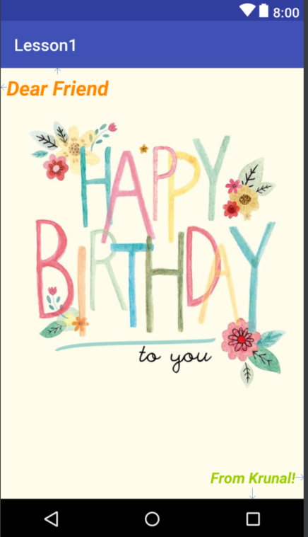

# Krunal Patel
## AndroidLesson1
  Learning to make android apps. First step, I created a basic UI for an android app. I used online resources to help me and free course offered by google on udacity.
  Topics Covered
  1. [This link](https://drive.google.com/file/d/0B5XIkMkayHgRMVljUVIyZzNmQUU/view "Common Android Views") 
  

